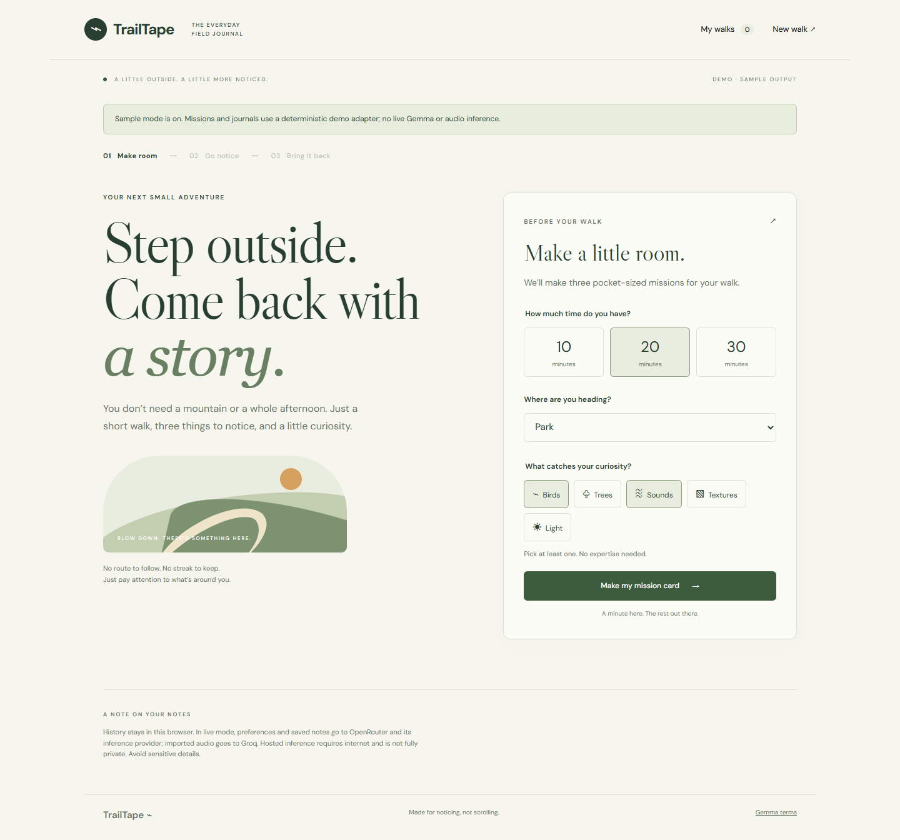

# TrailTape

**Three pocket missions. One small walk. A journal in your own words.**

TrailTape gives you a small reason to step outside without turning the walk into
another screen-heavy activity. Choose a duration, setting, and interests; Gemma
prepares three short missions. Print or save the card, put the screen away, and
notice what's around you. You don't have to complete every mission.

Afterward, optionally bring back typed observations or a voice note. Listen to
your recording, review and correct the transcript, then save it. TrailTape builds
a journal with exact original-note excerpts, source links, and a suggestion for
your next walk. History and unfinished text drafts stay in this browser; no
account or database is required.

[Repository](https://github.com/Rohan-Saxena644/TrailTape) ·
[Journal screenshot](artifacts/voice-journal-desktop.png) ·
[Mobile voice-note screenshot](artifacts/voice-notes-mobile.png)



These screenshots show the implemented interface with synthetic/sample inputs;
they are not evidence of an outdoor walk. Built for
[Hacktoberfest Week 1: Touch Grass](https://dev.to/challenges/hacktoberfest-week1-2026-10-05).

## Run locally

Use **Node.js 22.16+** and npm.

```sh
git clone https://github.com/Rohan-Saxena644/TrailTape.git
cd TrailTape
npm ci
```

Copy `.env.example` to `.env` once, then edit it locally. Keep an existing
configured `.env` rather than overwriting it.

```powershell
Copy-Item .env.example .env
```

On macOS/Linux, use `cp .env.example .env`. The example file still contains
OpenRouter defaults: **replace its Gemma settings with all the Google settings
below before using a Google AI Studio key.**

```dotenv
AI_MODE=live
GEMMA_API_KEY=your_google_ai_studio_key
GEMMA_BASE_URL=https://generativelanguage.googleapis.com/v1beta/openai
GEMMA_MODEL=gemma-4-26b-a4b-it
GEMMA_OUTPUT_FORMAT=prompt

TRANSCRIPTION_API_KEY=
TRANSCRIPTION_BASE_URL=https://api.groq.com/openai/v1
TRANSCRIPTION_MODEL=whisper-large-v3-turbo

API_PORT=3001
DEV_FRONTEND_ORIGIN=http://localhost:3000
```

Get the text-generation key from [Google AI Studio](https://aistudio.google.com/apikey).
Audio uses a **separate** [Groq key](https://console.groq.com/keys). Leave
`TRANSCRIPTION_API_KEY` empty if you only want typed notes. Keys stay on the
backend; `.env` is ignored by Git. Never include real keys in screenshots or commits.

```sh
npm run dev
```

Open **http://localhost:3000**. Next.js serves the frontend on 3000 and proxies
`/api` to Express on 3001. Restart both after changing `.env`. In PowerShell,
use `npm.cmd` if script policy blocks `npm`.

Only start one development stack for this checkout. If Next reports an existing
server, use that server or stop its terminal with Ctrl+C before restarting.
For a different frontend hostname/port, set its exact `DEV_FRONTEND_ORIGIN`.
The proxy-aware origin checks permit that development frontend and reject
unrelated explicit origins; production retains checks for its own origin and
cross-site Fetch Metadata. No wildcard CORS is enabled.

To explore without keys, set `AI_MODE=demo`. This explicitly labeled mode uses
fixed missions and deterministic note excerpts; it does not call Gemma and has
no transcription. Live errors never silently substitute demo output.

## Production

Stop the development stack, then run from the repository root:

```sh
npm run build
npm start
```

The build compiles Next.js and the backend. `npm start` serves both through one
Express process at **http://localhost:3001**, or the configured `PORT`/`API_PORT`.
The compiled entry point selects production mode.

[render.yaml](render.yaml) is a prepared deployment blueprint, not a deployed
demo. Its provider defaults are OpenRouter. To use the verified Google setup,
override its Gemma base URL, model, and output format with the values above and
set credentials in the host's secret settings. History belongs to the browser
origin; changing hostnames does not migrate it.

## Providers and architecture

The live configuration verified on **9 October 2026** uses:

| Purpose                                 | Provider            | Model                    | Base URL                                                  |
| --------------------------------------- | ------------------- | ------------------------ | --------------------------------------------------------- |
| Missions, journal, next-walk suggestion | Google-hosted Gemma | `gemma-4-26b-a4b-it`     | `https://generativelanguage.googleapis.com/v1beta/openai` |
| Voice transcription                     | Groq-hosted Whisper | `whisper-large-v3-turbo` | `https://api.groq.com/openai/v1`                          |

Google calls its hosting interface the Gemini API, but the requested model here
is **Gemma 4**, not Gemini. Google documents this exact model in its
[hosted Gemma guide](https://ai.google.dev/gemma/docs/core/gemma_on_gemini_api).
TrailTape uses its OpenAI-compatible chat endpoint with thinking disabled for
this model. `GEMMA_OUTPUT_FORMAT=prompt` omits unsupported response-format
assumptions; application validation still runs. Groq receives multipart audio
through its [speech-to-text API](https://console.groq.com/docs/speech-to-text).

```text
Next.js UI -> same-origin /api -> Express -> Google / Gemma
                                        -> Groq / Whisper
Browser localStorage: walk history and unfinished text drafts
```

`app/` contains the interface, `server/` the private provider calls, and `shared/`
the schemas, grounding rules, and Markdown exports. The adapters accept
configurable compatible endpoints; changing a URL alone does not establish model
compatibility. This release does not run a local model or fine-tune one. Published
Gemma weights leave a path to other hosting or self-hosting; prompts and
[synthetic evaluation inputs](docs/evaluation.json) are inspectable in the repo.

## Notes, voice, and grounding

- **Record → Stop → playback → Review transcript → correct → Save.** Recording
  requests microphone permission on click and releases the microphone on stop or
  cancellation. It stops automatically at 90 seconds; audio is capped at 10 MB.
  Imported clips have format/size checks, but their duration is not measured.
- Recording requires HTTPS or localhost. On a phone opening a plain HTTP LAN
  address, use its voice recorder and import an audio file instead. Supported
  detected formats: WAV, MP3, M4A/MP4, OGG, WebM, and FLAC.
- Typed drafts, reviewed transcripts, and unfinished edits recover after refresh
  and remain attached to their walk. Raw audio stays in tab memory and is lost on
  refresh. Failed transcription retains the clip for Retry or Discard.
- Notes have stable IDs. Editing a saved note preserves its ID and invalidates
  the journal so it can be regenerated from the corrected source.
- Strict Zod validation rejects unknown citations. Every recorded observation
  must quote one **entire saved note exactly**, and every input note must appear.
  This preserves words such as “maybe” and “I couldn't identify it.”
- Tentative interpretations are optional; an empty section is omitted. Any
  comparison must cite at least two distinct notes. Prompts discourage species
  guesses and simple paraphrases. These checks establish structure and source
  presence, **not semantic accuracy**: generated titles, interpretations, and
  next missions still need review. Numbered source links open the original notes.

Limits include 20 notes per journal, 2,000 characters per note/transcript, and
64 KB JSON input. Malformed or truncated output is rejected without inventing a
repair. Provider attempts time out after 20 seconds, with at most one retry for
transient failures; proxy/browser deadlines allow those attempts to finish.
Readable errors keep notes available for retry. Local throttling is 20 API
requests per minute per IP, with at most two simultaneous audio uploads.

## Your data

Walk cards, saved notes, journals (up to 100 walks), and unfinished text drafts
use **unencrypted localStorage**. There is no server database, login, or device
sync. Clearing browser data removes them; shared-device access and storage limits
matter. Storage failures show a warning, and failed history saves retain the
earlier draft backup.

Export finished journals or mission cards as Markdown; cards also support
print/save to PDF. Unsaved drafts are not a full backup export. Delete a walk
through **My walks** to remove its local notes, journal, and draft, or clear an
individual unfinished draft. Export before clearing browser data.

In live mode, preferences go to Google for mission generation. Creating a
journal sends that walk's saved notes, including corrected transcripts, to Google.
Unfinished drafts are not sent to Gemma until saved and used for a journal.
Requesting transcription sends the raw clip through Express to Groq. The app
does not persist raw audio in history or server files; backend buffers are
cleaned up after processing. Local deletion does not retract data already sent
to a provider.

Hosted inference needs internet and external processing. Google unpaid-service
data handling is described in its [API terms](https://ai.google.dev/gemini-api/terms);
review [Groq's data controls](https://console.groq.com/docs/your-data) too.
Local history does not imply complete privacy or offline AI. Provider access,
free quotas, and availability can change. Download/print a card before leaving;
there is no offline service worker. Fonts are served locally, without analytics
or remote UI images.

## Verification and limits

Existing verification records dated **9 October 2026** report:

| Check                                  | Recorded result                                                                                                                                               |
| -------------------------------------- | ------------------------------------------------------------------------------------------------------------------------------------------------------------- |
| Automated tests                        | 37 passing tests, both frontend/backend type checks, and production build                                                                                     |
| Browser workflow                       | Production demo: desktop/mobile, print/export, citations, history, editing/regeneration, deletion; voice/draft checks include permission and storage failures |
| Development routing                    | Status and mission requests through `localhost:3000`; unrelated explicit origin rejected with 403                                                             |
| Real Gemma inference, synthetic inputs | Successful mission/journal browser runs; separate two-note journal check preserved exact quotes with zero interpretations                                     |
| Real Groq inference, synthetic speech  | Successful WAV upload and browser-recorded WebM transcription using a fake microphone backed by synthetic speech                                              |
| Outdoor use and human speech in noise  | Pending; no user study or overall accuracy claim                                                                                                              |

Routing success and actual inference success are separate results. Other real
Google attempts returned provider errors or timed out; successful calls do not
guarantee availability. The synthetic microphone checks do not establish outdoor
transcription quality. There is no species identification, mapping, location
tracking, or persistent audio archive.

Details: [voice/draft verification](docs/voice-and-drafts.md),
[Google routing and live inference](docs/google-proxy-verification.md).

```sh
npm run typecheck
npm test
npm run build
```

For browser checks, install Chromium with `npx playwright install chromium` or
set `BROWSER_EXECUTABLE` to installed Chrome/Edge. Run `npm run test:browser`
against a running production **demo-mode** server. For voice and live-proxy
checks, follow the records above (`npm run test:voice`, `npm run test:dev-proxy`).
Voice tests mock transcription by default; `TEST_LIVE_AUDIO=1` uses real Groq
with synthetic speech. Live checks and `npm run evaluate` consume provider quota.
The evaluation script contains six synthetic cases and emits output, validation
results, and elapsed times; its existence is not a completed live evaluation.

## License and attribution

Application code is [MIT licensed](LICENSE); see [NOTICE](NOTICE) for component
attribution. The interface uses Next.js, React, Express, and Zod. DM Sans and
Libre Caslon Display are bundled through Fontsource under their included SIL
Open Font Licenses. [Whisper](https://github.com/openai/whisper) is MIT licensed.
Google lists Gemma 4 under Apache 2.0 in its
[model card](https://ai.google.dev/gemma/docs/core/model_card_4); earlier Gemma
models have separate [Gemma terms](https://ai.google.dev/gemma/terms).
No model weights are distributed here. Hosted use is also subject to
[Google API terms](https://ai.google.dev/gemini-api/terms) and
[Groq terms](https://groq.com/terms-of-use/), or the terms of any replacement host.

For the challenge walkthrough, see the
[outdoor/demo checklist](docs/demo-checklist.md) and
[unpublished submission draft](docs/submission-draft.md).
